
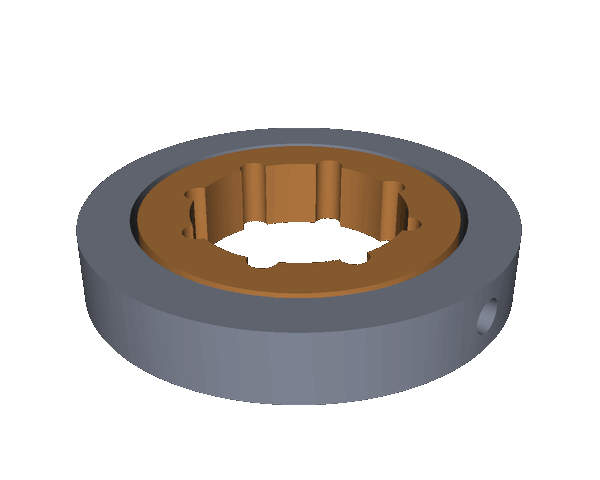


# OpenCAD

A modular CAD system for parametric, programmable, and AI-assisted design

[](https://pypi.org/project/opencad/)
[](https://pypi.org/project/opencad-agent/)
[](https://pypi.org/project/opencad-backend/)
[](https://pypi.org/project/opencad/)
[](https://www.npmjs.com/package/opencad-viewport)
[](LICENSE)

<p align="center">
  
  
  
</p>

## Install for Claude, Codex, OpenCode, OpenClaw, or NemoClaw

Install the OpenCAD skill for Claude, Codex, OpenCode, or OpenClaw with one
command:

```bash
npx skills add caid-technologies/OpenCAD
```

OpenClaw also discovers `skills/create-cad-files` directly when this repository
is its workspace. OpenCode can discover the checked-in adapters under both
`.opencode/skills` and `.agents/skills`.

For a running NemoClaw sandbox, install the canonical skill from a checkout of
this repository (replace `my-assistant` with the sandbox name):

```bash
nemoclaw my-assistant skill install ./skills/create-cad-files
```

Then ask the agent normally:

```text
Create a 72 mm round spray bottle and give me STEP and STL files.
```

The agent writes the parametric source, builds real OCCT geometry, validates
the artifacts, and returns clickable file paths. No manual Python or CLI work
is required from the user. The repository also ships provider-native manifests
under `.codex-plugin/` and `.claude-plugin/`.

## Components

- `opencad.kernel` — geometry kernel and typed operation registry
- `opencad.solver` — 2D sketch constraint solving (SolveSpace + Python fallback)
- `opencad.tree` — parametric feature-tree DAG (CRUD + rebuild + stale propagation)
- `opencad_agent` — AI agent that plans and executes operations
- `opencad_server` — FastAPI transport mounting all of the above
- `opencad-viewport` — publishable React + Three.js component library (npm)

## Layout

This is a uv workspace of three Python distributions and a pnpm workspace
holding one npm package, all independently installable. The core carries no
web framework: the dependency arrow runs core ← agent ← backend and never the
other way. Applications under `apps/` are never published; they consume the
libraries under `packages/`.

```text
packages/
├── opencad/             # dist: opencad — kernel, solver, tree, fluent API, CLI
│   ├── src/             #   pydantic + numpy only. No FastAPI, no httpx.
│   └── tests/
├── opencad-agent/       # dist: opencad-agent — LLM modelling on the core
│   ├── src/             #   depends on opencad; [llm] extra adds LiteLLM
│   └── tests/
└── opencad-viewport/    # npm: opencad-viewport — React component library
    └── src/             #   react/three are peer deps, never bundled
apps/
├── backend/             # dist: opencad-backend — the only FastAPI consumer
│   ├── src/             #   opencad_server: routers, app factory, HTTP client
│   └── tests/
└── opencad_viewport/    # reference app hosting the components (not published)
scripts/                 # Development and smoke-test scripts
```

Each package installs and tests on its own; CI runs a job per package with
only that package's dependencies present, so a core module that reaches for
the backend fails the build.

## Quickstart

**Prereqs:** Python 3.11+ and Node.js 18+

### 1. Install

Published on PyPI. Pick the layer you need — each installs independently, and
each pulls the ones below it:

```bash
pip install opencad                   # core: kernel, solver, tree, fluent API, CLI
pip install "opencad[occt]"           #   + OCCT B-rep backend (real STEP/STL)
pip install "opencad-agent[llm]"      #   + natural-language modelling
pip install opencad-backend           #   + the FastAPI HTTP service
```

Installing `opencad` alone gets you a working kernel with **no web framework in
the environment** — no FastAPI, no httpx. That is the point of the split:

```python
from opencad import Part, Sketch

plate = Part().extrude(Sketch().rect(80, 30), depth=4)
plate.fillet(edges="all", radius=1.0)
```

Cross-package versions move in lockstep and are pinned exactly, so
`opencad-agent 0.2.3` can only resolve against `opencad 0.2.3`.

The React components ship separately on npm:

```bash
npm install opencad-viewport react react-dom three @react-three/fiber @react-three/drei
```

React, Three.js, and the react-three packages are peer dependencies — they are
singleton-sensitive, so the library never bundles them.

For local development from this repository:

```bash
uv sync --all-packages --all-extras --group test
cp .env.example .env
```

Keep `--all-extras`. The OCCT B-rep backend ships behind the `occt` extra, and
without it the kernel falls back to the analytic backend, which cannot export
STEP.

To work on one package in isolation, sync only its dependencies:

```bash
uv sync --package opencad --extra occt --group test          # core alone, no web stack
uv sync --package opencad-agent --group test                 # core + agent
uv sync --package opencad-backend --extra occt --group test  # everything
```

### 2. Start backend services

```bash
uv run --package opencad-backend --extra occt \
  python -m uvicorn opencad_server.app:app --reload --port 8000
```

`opencad_server.app` mounts every service router under one process. To run a
single service standalone, point uvicorn at its router module instead — for
example `opencad_server.kernel_router:app` or `opencad_server.solver_router:app`.

### Run the dev script

To start the backend and frontend together from the repository root:

```bash
cd apps/opencad_viewport
pnpm install
cd ../..
./scripts/run_dev.sh
```

This starts:

- backend: `http://127.0.0.1:8000`
- frontend: `http://127.0.0.1:5173`

The launcher syncs the backend server, LLM, and OCCT dependencies before startup.

Press `Ctrl+C` to stop both services.

Optional environment overrides:

```bash
BACKEND_HOST=0.0.0.0 BACKEND_PORT=8000 FRONTEND_HOST=0.0.0.0 FRONTEND_PORT=5173 ./scripts/run_dev.sh
```

### 3. Check health

```bash
curl -s http://127.0.0.1:8000/kernel/healthz   # → {"status":"ok"}
curl -s http://127.0.0.1:8000/agent/healthz
curl -s http://127.0.0.1:8000/solver/healthz
curl -s http://127.0.0.1:8000/tree/healthz
```

### 4. Start the frontend

```bash
pnpm install                             # from the repository root
pnpm --filter opencad-viewport build     # build the component library first
pnpm --filter opencad-viewport-app dev   # → http://localhost:5173
```

The viewport uses **mock geometry/solver data** by default (no backend required for those flows).
Chat targets the live agent service by default; set `VITE_USE_CHAT_MOCK=true` if you explicitly want mocked chat output.
Set `VITE_USE_MOCK=false` to connect the rest of the viewport to the live services above.

### 5. Run with Docker

Build the backend image from the repository root so Docker can see the Python
project metadata and backend package files:

```bash
docker build -f apps/backend/Dockerfile -t opencad-backend .
```

Build the frontend image from the repository root too — the app depends on the
`opencad-viewport` workspace library:

```bash
docker build -f apps/opencad_viewport/Dockerfile -t opencad-frontend .
```

Run the backend API on port `8000`:

```bash
docker run --rm -p 8000:8000 opencad-backend
```

Run the frontend on port `5173`:

```bash
docker run --rm -p 5173:80 opencad-frontend
```

By default, the frontend image is built with `VITE_BASE_URL=http://localhost:8000`
and live API calls enabled. To point the frontend at another API URL or enable
mock mode, pass build args:

```bash
docker build \
  -f apps/opencad_viewport/Dockerfile \
  -t opencad-frontend \
  --build-arg VITE_BASE_URL=http://localhost:8000 \
  --build-arg VITE_USE_MOCK=false \
  --build-arg VITE_USE_CHAT_MOCK=false \
  .
```

## Configuration

Runtime defaults are documented in `.env.example`.

- `OPENCAD_ENABLE_DOCS=true|false` toggles OpenAPI/docs route exposure.
- `OPENCAD_CORS_ALLOW_ORIGINS` sets a comma-separated browser origin allowlist.
- `OPENCAD_KERNEL_BACKEND=analytic|occt` selects the kernel backend.
- `OPENCAD_SOLVER_BACKEND=auto|solvespace|python` selects the solver backend.

For production, disable docs and set a strict CORS origin list.

## Security

Use TLS + authentication at your reverse proxy/API gateway.
Do not commit `.env` files, tokens, or private datasets.
See `SECURITY.md` for coordinated vulnerability reporting.

## Testing

Run the whole workspace:

```bash
uv sync --all-packages --all-extras --group test
uv run --no-sync python -m pytest
```

Without `--all-extras` the OCCT backend is absent, and the tests that need real
B-rep geometry skip rather than fail — so the suite still reports green while
leaving the native kernel untested.

Or test one package with only its own dependencies installed — this is what CI
does, and it is what keeps the core independent of the backend:

```bash
uv sync --package opencad --extra occt --group test
cd packages/opencad && uv run --no-sync --package opencad --project ../.. python -m pytest
```

## Headless Scripting

OpenCAD now includes a first-class in-process API for scripting workflows with automatic feature-tree logging.

```python
from opencad import Part, Sketch

part = Part()
sketch = Sketch().rect(10, 20).circle(3, subtract=True)
part.extrude(sketch, depth=5).fillet(edges="top", radius=0.5)
part.export("output.step")
```

Every fluent call appends a built `FeatureNode` to the in-memory DAG, so headless runs are recoverable.
Fluent sketches also persist `entities` + `profile_order` metadata in the sketch node, matching agent-path ordering semantics for deterministic profile reconstruction.

## CAID Design Artifact

OpenCAD can export a versioned JSON artifact for SimCorrect. The artifact carries the feature tree, named parameters, and simulation tags; SimCorrect returns structured parameter patches against those names.

```python
from opencad import Part, Sketch

part = Part(name="forearm").extrude(Sketch().rect(30, 4), depth=4)
part.export_design_artifact(
    "caid-design.json",
    artifact_id="forearm-demo",
    parameters={"forearm_length": {"value": 0.30, "unit": "m", "role": "geometry"}},
    simulation_tags=[
        {"name": "right_forearm", "kind": "body", "target": "r_forearm"},
        {"name": "forearm_length", "kind": "parameter", "target": "link2_length"},
    ],
)
```

## CLI

```bash
opencad build model.json --output model.built.json
opencad run model.py --export output.step --tree-output output-tree.json
opencad run model.py --export output.stl --tree-output output-tree.json
```

STEP and STL export use the native OCCT backend. Install it with
`uv sync --extra occt`; the CLI's default `--backend auto` mode selects it
automatically whenever `--export` is requested. The analytic backend can be
selected explicitly for tree-only validation with `--backend analytic`, but it
does not produce user-deliverable CAD files.

### Turntable preview

`--turntable` renders the model rotating a full 360° about the vertical axis
and writes it as an animated GIF, or an MP4 when asked. It runs headless — no
browser, no display server, no GPU — so it works anywhere the CLI does. GIFs
use a transparent background and neutral grayscale model shading; MP4 output
uses a light matte because the browser-compatible video stream has no alpha.


*A 2 MB drone STEP assembly rendered as a 60-frame transparent GIF.*

```bash
opencad run model.py --export part.step --turntable part.gif
opencad run model.py --turntable part.mp4 --turntable-frames 90
```

The format follows the file extension unless `--turntable-format` overrides it.
`--turntable-frames` (default 60), `--turntable-fps` (25), `--turntable-size`
(640x480), and `--turntable-deflection` (0.1) tune the output; frame size is
rounded up to even dimensions because H.264 requires it.

GIF needs only Pillow (`uv sync --extra render`). MP4 additionally needs a
bundled ffmpeg (`uv sync --extra video`) and reports which extra to install if
it is missing. Like `--export`, a turntable requires the OCCT backend, since
the analytic backend cannot tessellate.

The same thing is available in-process, for callers that should not shell out:

```python
from opencad import Part, TurntableOptions, get_default_context

Part().box(30, 12, 5)
context = get_default_context()
context.export_turntable(
    context.last_shape_id,
    "part.gif",
    options=TurntableOptions(frames=90, width=800, height=600),
)
```

## Agent skill

The installable `create-cad-files` skill lives under `skills/create-cad-files`.
Small repository adapters under `.agents/skills`, `.claude/skills`, and
`.opencode/skills` make the same workflow available automatically while
developing OpenCAD. OpenClaw reads the canonical `skills/` directory directly,
and NemoClaw can upload that directory with `nemoclaw <sandbox> skill install`.
Every integration uses the same instructions, scripts, and references. The
skill turns a dimensional request into an OpenCAD Python model, then atomically
exports and validates STEP, STP, or STL.

## Documentation

- [CHANGELOG.md](CHANGELOG.md) - release notes
- [CONTRIBUTING.md](CONTRIBUTING.md) - development and contract workflow
- [docs/CAID_ARTIFACT_CONTRACT.md](docs/CAID_ARTIFACT_CONTRACT.md) - artifact and patch semantics
- [docs/RECONSTRUCTION_AND_UPGRADE_PLAN.md](docs/RECONSTRUCTION_AND_UPGRADE_PLAN.md) - local reconstruction status and CAID upgrade plan

- [PRODUCTION.md](PRODUCTION.md) — deployment, routes, and verification
- [ARCHITECTURE.md](ARCHITECTURE.md) — component design and API contracts
- [TOPOLOGY.md](TOPOLOGY.md) — topology reference stability (open research question)
- [SECURITY.md](SECURITY.md) — vulnerability reporting and hardening baseline
